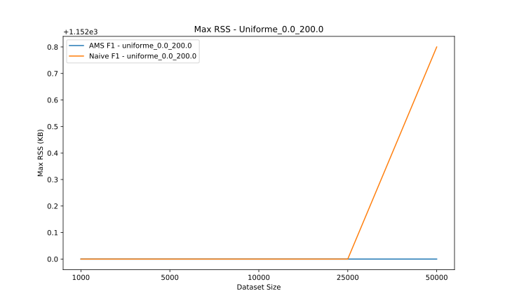

# AMS Frequency Moments
Il seguente documento è tratto da un analisi del paper di Alon, Matias, e Szegedy, "The Space Complexity of Approximating the Frequency Moments" [1]. 

Questo documento si propone di definire uno pseudocodice per l'algoritmo AMS Frequency Moments, per poi procedere con la sua implementazione in C/C++.

L'attenzione è stata concentrata sui momenti di ordine $k$ pari a 0 e 1.

## Introduzione
Sia $A = (a_1, a_2, ..., a_m)$ una sequenza di m elementi, con $a_i ∈ N=\{1,2,...,n\}$.

Denotiamo con $m_i$ le occorrenze i-esime nella sequenza A.

Il momento di ordine k è dato da $F_k = \sum_{i=1}^{n} m_i^k$, dove $m_i$ è il numero di occorrenze di $i$ nella sequenza.

$F_k$ è definito come la somma k-esime potenze dei conteggi $m_i$.

L'obiettivo dell'algoritmo AMS consiste nel fornire una stima accurata di $F_k$ usando un algoritmo randomizzato.

## Estimating $F_k$

Estraiamo un numero casuale $a_p$ della sequenza, dove l'indice $p$ è stato scelto in modo casuale e uniforme tra gli indici $1, ...,m$. Possiamo quindi definire $r$ come segue.

Sia $r=|\{q:q \ge p, a_q =  a_p\}|$ il conteggio di $a_p$ in $A$, da un fissato $p$ in poi.

Definiamo la variabile $X=m(r^k - (r-1)^k)$.

Nel caso in cui $m$ sia sconosciuta: quando $a_m$ (elemento m-esimo della sequenza) arriva, viene rimpiazzato ad $a_p$ con probabilità $1/m$, in caso di rimpiazzo $r$ viene impostato a 1, altrimenti viene incrementato se $a_m = a_p$.

Come dimostrato da Alon et al. [1], si ha che:
$E(X) = ∑_{i=1}^n m_i^k = F_k$ 
$Var(X) = E(X^2) - (E(X))^2$ dove $E(X^2) ≤ kF_1F_{2k-1}$ .

### Algoritmo
#### PSEUDOCODE


Procedimento per una singola variabile X.


Case: m known
```
AMS_Frequency_Moment_m_known(A, k, m): # A stream, k moment order, m length 
                                    of the stream
  initialize...
  p <- rand uniform (1,m)
  r <- 1
  q <- p + 1

  # procedure...
  while(steam, starting from q)
    if(a_q == a_p)
      r <- r +1  
    q <- q + 1
  end while
  compute X = m(r^k - (r-1)^k)
  return X

```

Case: m unknown
```
AMS_Frequency_Moment(A, k): # A stream, k moment order
  # initialize...
  r <- 1
  a_p <- A[0]
  m <- 1

  # procedure...
  while stream do:
      pick random number in U(0,1)
      if random number < 1 / m: # with prob. 1/m accept replacement
          a_p <- A[m]    
          r <- 1
      else if A[m] == a_p:  # increase r
          r <- r + 1
      end if
      m <- m + 1 # update m
  end while
  X <- m * (r^k - (r - 1)^k)  # compute X
  return X

```

## Input file e premesse
Lo stream utilizzato dai programmi *ams_f0* ed *ams_f1* è stato generato dal programma "generate_stream", disponibile nella directory "stream_generator".

I programmi *ams_f0* ed *ams_f1* sono stati testati e progettati per funzionare con un file di input contenente una serie di numeri interi e non negativi, ognuno disposto su una riga e separata da un punto e virgola. È inoltre disponibile uno script denominato "pulizia_stream.sh" che consente la rimozione di tutti i caratteri ad esclusione dei caratteri non numerici e del carattere separatore.

Esempio del formato del file di input:
```
11;
11;
19;
97;
8;
52;
54;
```

### Makefile
Per semplificare la compilazione dei programmi, è stato progettato un **Makefile**, i comandi disponibili sono "make" ed "make clean".


### Script di Pulizia (pulizia_stream.sh)
Lo script di pulizia è stato pensato per facilitare la fase preliminare della preparazione del file di input.

Uso dello script: ./pulizia_stream.sh [file_input] [file_output]
- Se non vengono passati argomenti, verranno utilizzati dei valori di default per file_input e file_output
- Se viene passato un solo argomento, verrà usato lo stesso argomento sia come file_input che come file_output
- Se vengono passati due argomenti, verranno utilizzati come file_input e file_output rispettivamente
- Viene inoltre effettuato un controllo sul numero di argomenti, il numero degli argomenti deve essere <= 2

### Stream generator
Per generare lo stream utilizzato in questo lavoro è stato implementato in C++ un **generatore di numeri pseudo-casuali**. Questo generatore, disponibile nella directory "stream_generator", si occupa inoltre del salvataggio dello stream in formato CSV, con possibilità di salvare l'output anche in altre estensioni.

Nella stessa directory sono presenti due script di utility scritti in bash: "test_generatore.sh" e "controllo_input.sh". Questi script hanno lo scopo di testare le combinazioni di input disponibili, verificando sia il corretto funzionamento delle opzioni disponibili che il corretto funzionamento dei meccanismi di controllo dell'input inserito da utente.


Le distribuzioni implementate per la generazione dei numeri sono le seguenti:
- uniforme
- esponenziale
- poisson

#### Usage

Il programma dispone di un opzione di usage, richiamabile tramite l'opzione -h, che stampa il seguente messaggio.
```
Utilizzo: ./generate_stream [-d distribuzione] [-l lambda] [-a min] [-b max]
                             [-n lunghezza] [-f file]
Il seguente programma genera uno stream di numeri pseudo-casuali,
     salvando il risultato in un file in formato CSV.
ATTENZIONE: Il seguente programma fornisce in output un file CSV di 
    numeri interi, quindi per conservare le cifre decimali bisogna
    utilizzare l'opzione x
Le opzioni disponibili sono le seguenti:
  -h                Messaggio di aiuto
  -d distribuzione  Permette di specificare una distribuzione da usare: uniforme, esponenziale, poisson. Default = uniforme
  -l lambda         Permette di specificare il parametro lambda usato per le distribuzioni esponenziale e Poisson. Default = 10
  -a min            Permette di specificare il limite inferiore per la distribuzione uniforme. Default = 0
  -b max            Permette di specificare il limite superiore per la distribuzione uniforme. Default = 100
  -n lunghezza      Permette di specificare la lunghezza dello stream. Default = 200
  -x cifre          Permette di specificare il numero di cifre decimali da mantenere. Default = 0
  -f file           Permette di specificare il nome del file CSV fino ad un massimo di 49 caratteri. Default = stream
  -e estensione     Permette di specificare l'estensione del file fino ad un massimo di 4 caratteri. Default = CSV
  NOTA - caratteri non accettati: spazi, stringhe vuote, stringhe con solo spazi, caratteri speciali diversi da virgola, trattino e punto
```

#### Implementazione
La libreria getopt è stata utilizzata in modo da permettere l'utilizzo delle opzioni.

La funzione err_sys è stata implementata per gestire gli errori. Tale funzione ha lo scopo di mostrare a schermo un messaggio di errore descrittivo e di terminare l'esecuzione del programma.

Le funzioni "uniforme" e "esponenziale" sono state adattate per generare numeri interi. Il numero generato viene moltiplicato per $10^x$, dove $x$ è uno dei parametri modificabili, e successivamente troncato.

Sono stati eseguiti i seguenti controlli sull'input inserito da utente:
- dopo i numeri (a, b, lambda, x ed n) non ci siano lettere o caratteri simili
- la lunghezza dello stream e x siano un numeri interi e positivi
- a,b e lambda siano numeri decimali positivi
-  i numeri decimali e interi (a, b, lambda, x e n) siano inferiori al valore massimo possibile.
- b sia maggiore di a
- l'input relativo alla distribuzione è troncato per accettare massimo 12 caratteri
- il nome del file sia più corto di 50 caratteri e che non contenga spazi, stringhe vuote, stringhe con solo spazi e caratteri speciali diversi da virgola, trattino e punto
- il nome dell'estensione sia più corto di 5 caratteri

Implementazione della generazione dello stream:
```c
// ----------------------- PSEUDO NUMBER GENERATOR -----------------------
int uniforme(std::default_random_engine& generator, double a, double b, int x) {
    std::uniform_real_distribution<double> distribuzione(a, b);
    double numero = distribuzione(generator);
    return static_cast<int>(numero * std::pow(10, x));
}

int esponenziale(std::default_random_engine& generator, double lambda, int x) {
    std::exponential_distribution<double> distribuzione(lambda);
    double numero = distribuzione(generator);
    return static_cast<int>(numero * std::pow(10, x));
}


double poisson(std::default_random_engine& generator, double lambda) {
    std::poisson_distribution<int> distribuzione(lambda);
    return distribuzione(generator);
}
```

```c
    // --- GENERAZIONE STREAM ---
    for (int i = 0; i < n; i++) {       
        switch (distribuzione) {
            case UNIFORME:
                file << uniforme(generator, a, b, x) << "\n";      // genero numero e salvo su file
                break;
            case ESPONENZIALE:
                file << esponenziale(generator, lambda, x) << "\n";
                break;
            case POISSON:
                file << poisson(generator, lambda) << "\n";
                break;
     
        }
    }
```

## Momento di ordine 0: $F_0$

Alon et al., [1] per l'implementazione del momento di ordine 0 propone una modifica dell'algoritmo Flajolet-Martin [2] per calcolare il momento di ordine 0.
L'implementazione introduce randomicità mediante l'uso della funzione z_hash, permettendo di ottenere una stima $F_0$. Così facendo è necessario utilizzare solo O(log n) bit di memoria per contenere l'informazione.

Il momento di ordine k = 0, indicato anche $F_0$, è utilizzato per stimare il numero di elementi distinti in uno stream. 

Sia definito il campo $F=GF(2^d)$, dove d è il più grande intero t.c. $2^d>n$.

Siano $a,b$ due numeri casuali definiti in $F$, si computi $z_i = a * a_i +b$, con prodotto e somma riferiti al campo $F$. 

La funzione z così definita fornisce un mapping pairwise independent [1].

Sia $r(z)$ il numero di trailing $0s$. Sia $R$ il massimo valore di $r_i$, dove $r_i=r(z_i)$.

L'output dell'algoritmo è dato da $Y=2^R$.


### Pseudocode

```
AMS_Frequency_Moment_0(A): # A stream
  // initialize...
  a, b random chosen
  
  // procedure...
  R <- (- inf)
  while(stream)
    z_i <- z(a_i)
    r_i <- r(z_i)
    R <- Max(r_i,R)
  end
  return 2^R

define z: z=a*x+b
define r: r calculate number of trailing 0s
```

### Output
Il programma offre diverse opzioni di output:
- Stampa a schermo dei risultati, è possibile disabilitare questa opzione
- Salvataggio in un file in formato csv

AVVERTENZA: Il programma non crea automaticamente il file csv su cui salvare i risultati, pertanto bisogna assicurarsi dell'effettiva presenza del file.

L'output del programma consiste in una rappresentazione eelle seguenti variabili: stima del momento di ordine 0 e tempo di esecuzione in secondi dell'algoritmo.

File csv:
```
algoritmo,stima,esecuzione
ams,128,0.000087
```
Output del terminale:
```
AMS Frequency Moments - momento di ordine 0
Distinct item stimati: 128
Tempo di esecuzione: 0.000087 [s]
```


### Usage
Il programma dispone di un opzione di usage, richiamabile tramite l'opzione -h, che stampa il seguente messaggio.
```
Utilizzo: ./ams_f0 [-f nome_file] [-p path] [-o output_file] [-d path_output_file] [-s separatore] [-q] [-h] [-n iterazioni]
Il seguente programma utilizza l'algoritmo AMS per stimare calcolare il numero di F0, il risultato verrà poi salvato in un file in formato CSV.
Le opzioni disponibili sono le seguenti:
  -h                   Messaggio di aiuto
  -f nome_file         Permette di specificare il nome del file da utilizzare per il calcolo di F0.
  -p path              Permette di specificare il percorso del file da utilizzare per il calcolo di F0.
  -o output_file       Permette di specificare il nome del file da utilizzare per salvare i risultati.
  -d output_path       Permette di specificare il percorso in cui si trova il file di output.
  -s separatore        Permette di specificare il carattere di separazione degli elementi utilizzati nel file di input.
  -q                   L'opzione quiet permette di sopprimere l'output a schermo.
ATTENZIONE: Il programma non crea in automatico il file di output, quindi bisogna assicurarsi in anticipo della sua presenza.
```


### Implementazione
La libreria getopt è stata utilizzata in modo da permettere l'utilizzo delle opzioni.

La funzione err_sys è stata implementata per gestire gli errori. Tale funzione ha lo scopo di mostrare a schermo un messaggio di errore descrittivo e di terminare l'esecuzione del programma.

```c
sprintf(formato_input, "%%d%c", separatore);
delta_t = -clock();

while (fscanf(file, formato_input, &a_i) == 1){   // lettura per riga
    if (a_i >= 0 && a_i <= INT_MAX) {     //  controllo validità valore
        z_i = z_hash(a, a_i, b);
        r_i = trailing_0s(z_i);
        R = max(R,r_i);
    } else {
        printf("Errore: Letto valore sconosciuto, il valore letto verrà scartato");
    }
}

delta_t += clock();
delta_t = delta_t / CLOCKS_PER_SEC;  // tempo di esecuzione in secondi
distinct_item_estimate = 1 << R;    // elevamento a potenza usando shift a sinistra di R posizioni

```
Per il calcolo di $2^R$ si è utilizzato lo shift a sinistra, invece dell'utilizzo della libreria math. Questa opzione è stato resa possibile in quanto R è un numero intero (non negativo) e distinct_item_estimate è una potenza di due.

Per l’implementazione completa, si rimanda ad "ams_f0.c".


#### Controllo input utente
Per il controllo dell'input inserito da utente è stato fatto uso delle espressioni regolari in modo da limitare i caratteri inseribili.

Espressione regolare per i filename: ```"^[a-zA-Z0-9_.-\\ ]+$"```
Espressione regolare per i path: ```"^[a-zA-Z0-9_.-/\\ ]+$"```
```c
// utilizzo di strncpy per limitare i caratteri
strncpy(filename, optarg, MAXLENGTH - 1);
filename[MAXLENGTH - 1] = '\0';

// compilazione espressione
int result_compilazione_f = regcomp(&regex_function_filename, regex_filename, REG_EXTENDED);
if (result_compilazione_f) {
  char error_mex[20],error_mex_output[100];
  regerror(result_compilazione_f, &regex_function_filename, error_mex, sizeof(error_mex));
  sprintf(error_mex_output, "Errore durante la compilazione della regex per il filename: %s\t", error_mex);
  regfree(&regex_function_filename);
  err_sys(error_mex_output);
}

// controllo espressione regolare
int result_controllo_regex_f = regexec(regex_function_filename, optarg, 0, NULL, 0);
if (result_controllo_regex_f){
 char error_mex[20],error_mex_output[100];
 regerror(result_controllo_regex_f, regex_function_filename, error_mex, sizeof(error_mex));
 sprintf(error_mex_output, "Errore durante il controllodella regex per il filename: %s\t", error_mex);
 regfree(&regex_function_filename);
 err_sys(error_mex_output);
}

regfree(&regex_function_filename);  // libero memoria filename regex
```

#### Trailing 0s
La seguente implementazione in c calcola il numero di trailing 0s di un dato numero in input.
La funzione accetta solo numeri interi non negativi.
```c
int trailing_0s(int a_i) {

    int zeros = 0;
    while ((a_i & 1) == 0) {    // finchè il bit meno significativo è 0
        zeros++;    // counter trailing_0s
        a_i = a_i >> 1; // applico l'operazione bit a bit di spostamento a destra di 1 posizione
    }
    return zeros;
}
```

#### Hash function z
La funzione hash $z_i = a * a_i +b$ è stata implementata come segue
```c
srand(3454256);  // seed
a = rand() % 100;  // [0;99]
b = rand() % 100;  // [0;99]
```

```c
int z_hash(int a, int x, int b) {
    return a*x + b;
}
```

## Momento di ordine 1: $F_1$

Ricordiamo: $X=m(r^k - (r-1)^k)$


Il momento di ordine k pari a 1 ($F_1$) corrisponde alla lunghezza dello Stream (la somma di tutti gli elementi distinti). 


Per come è definito X, è sufficiente utilizzare un singolo contatore per calcolare il numero della lunghezza di uno stream.

Il funzionamento dell'algoritmo è il seguente: con probabilità pari ad 1/m viene accettato un elemento dello stream, incrementando il conteggio di m (contatore della lunghezza dello stream). 

```c
#include <stdlib.h>
unsigned int seed = 3454256;
srand(seed); 

int m = 1;

sprintf(formato_input, "%%d%c", separatore);
    
delta_t = -clock();
while (fscanf(file, formato_input, &a_i) == 1){
  double p_i = (double)rand() / RAND_MAX;
  if (rand_num < 1.0 / m) { 
    if (a_i >= 0 && a_i <= INT_MAX) { // se l'elemento è valido
        m++;
    } else {
        printf("Errore: Letto valore sconosciuto, il valore letto verrà scartato");
    }
  }
}

delta_t += clock();
```

Come *ams_f0*, questa implementazione di ams_f1 implementa gli stessi controlli sull’input dell’utente.

Per l’implementazione completa, si rimanda ad *ams_f1.c*.


### Output
*ams_f1* offre le medesime opzioni di output di *ams_f0*:
- Stampa a schermo dei risultati, è possibile disabilitare questa opzione
- Salvataggio in un file in formato csv

AVVERTENZA: Il programma non crea automaticamente il file csv su cui salvare i risultati, pertanto bisogna assicurarsi dell'effettiva presenza del file.

L'output del programma consiste in una rappresentazione eelle seguenti variabili: stima del momento di ordine 0 e tempo di esecuzione in secondi dell'algoritmo.

File csv:
```
algoritmo,stima,esecuzione
ams,157,0.000746
```
Output del terminale:
```
AMS Frequency Moments - momento di ordine 1 
Lunghezza dello stream stimata: 157
Tempo di esecuzione: 0.000746 [s]
```
### Usage
Il programma dispone di un opzione di usage, richiamabile tramite l'opzione -h, che stampa il seguente messaggio.
```
Utilizzo: ./ams_f1 [-f nome_file] [-p path] [-o output_file] [-d path_output_file] [-s separatore] [-q] [-h] [-n iterazioni]
Il seguente programma utilizza l'algoritmo AMS per stimare calcolare il numero di F1, il risultato verrà poi salvato in un file in formato CSV.
Le opzioni disponibili sono le seguenti:
  -h                   Messaggio di aiuto
  -f nome_file         Permette di specificare il nome del file da utilizzare per il calcolo di F1.
  -p path              Permette di specificare il percorso del file da utilizzare per il calcolo di F1.
  -o output_file       Permette di specificare il nome del file da utilizzare per salvare i risultati.
  -d output_path       Permette di specificare il percorso in cui si trova il file di output.
  -s separatore        Permette di specificare il carattere di separazione degli elementi utilizzati nel file di input.
  -q                   L'opzione quiet permette di sopprimere l'output a schermo.
ATTENZIONE: Il programma non crea in automatico il file di output, quindi bisogna assicurarsi in anticipo della sua presenza.
```

# Migliorare la stima di $F_0$ tramite Median of Means
Per migliorare la stima di $F_0$ è possibile utilizzare la tecnica "Median of Means". Questa tecnica consiste nell'eseguire l'algoritmo con multiple funzioni hash, raggrupparne i risultati, calcolare la media e infine selzionare la mediana come stima finale.

**Parametri**
- R: array contenente il numero massimo di trailing 0s per ogni funzione hash.
- a,b: array contenente i valori di a e b per ogni funzione hash.
- NHASH: numero di funzioni hash
- GROUHASH: numero di gruppi

Per l'implementazione si è deciso di utilizzare (NHASH) 10 funzioni hash e di suddividerle in (GROUHASH) 5 gruppi.


```c
while (fscanf(file, formato_input, &a_i) == 1) {
    if (a_i >= 0 && a_i <= INT_MAX) {
        for (int i = 0; i < NHASH; i++) {

            z_i = z_hash(a[i], a_i, b[i]);
            r_i = trailing_0s(z_i);
            R[i] = max(R[i], r_i);

        }
    }
}
```

Per calcolare la stima degli elementi distinti, si raggruppano i risultati in gruppi (NHASH / GROUHASH) e si calcola la media di ogni gruppo.
Successivamente, si calcola la mediana di queste medie in modo da avere una stima pià accurata degli elementi distinti.

```c
for (int i = 0; i < NHASH; i++) {
    d_i_estimates[i] = 1 << R[i];
}

for (int i = 0; i < NHASH / GROUHASH; i++) {
    double sum = 0.0;
    for (int j = 0; j < GROUHASH; j++) {
        sum += d_i_estimates[i * GROUHASH + j];
    }
    means[i] = sum / GROUHASH;
}

double distinct_item_estimate = median(means, NHASH / GROUHASH);
```


# Simulazione
L'obiettivo della simulazione è quella di valutare le prestazioni dei programmi implementati andando a considerare principalmente la memoria utilizzata, visto che l'algoritmo AMS è un algoritmo che si focalizza sul risparmio di memoria.

La simulazione consiste nell'esecuzione dei programmi con input di diversa dimensione (1000, 5000, 10000, 25000 e 50000 elementi) con diverse distribuzioni, le distribuzioni utilizzate sono:
- Poisson con λ = 75, in modo da garantire un sufficiente numero di valori distinti.
- Esponenziale con λ = 1, i valori ottenuti sono moltiplicati per $10^3$ prima di convertirli in interi, in modo da adattarsi meglio alla stima.
- Uniforme tra 0 e 200.


Per ogni input, ogni algoritmo è stato eseguito 100 volte. Successivvamente, sono state calcolate le mediane di ogni input in modo da ottenere delle stime più accurate.


Le metriche raccolte sono:
- Stima di $F_k$
- Tempo di esecuzione (in secondi)
- Maximum RSS: Maximum Resident Set Size che sarebbe la massima memoria utilizzata dall'algoritmo

**Premesse**
Per acquisire le informazioni necessarie circa le prestazioni dei programmi è stato fatto uso gnu-time (su mac).
Quindi, per eseguire la simulazione su mac bisogna installare gnu-time, per rendere disponibili informazioni come ‘Maximum resident set size’.

```bash
brew install gnu-time
```


Per valutare le prestazioni dell'implementazione degli algoritmi ams_f0 e ams_f1 sono state utilizzate delle implementazioni naive per il calcolo di $F_0$ ed $F_1$.

Le implementazioni naive utilizzano approcci più "naive" per il calcolo di $F_0$ ed $F_1$. Si basano sull'utilizzo di contatori senza particolare attenzione all'ottimizzazione della memoria utilizzata, andando di conseguenza ad utilizzare pi risorse rispetto alle altre implementazioni.


I plot usati sono disponibili su [Kaggle](https://www.kaggle.com/code/davidecantoro/ams-plot)

**Macchina di test**
L'esperimento è stato eseguito su un MacBook Pro con chip M3 Pro e 18 GB di RAM, SO: macOS Sonoma 14.6.1

## F0

### Maximum RSS
L'algoritmi ams_f0 e la sua variante precisa, dimostrano il comportamento atteso sull'utilizzo di memoria maggiore rispetto alle implementazioni AMS.
L'implementazione ams_f0_n (variamte più precisa di ams_f0 che la tecnica di Median of Means) riesce a mantenere un utilizzo di memoria simile rispetto alla sua variante standard.

Max RSS medi sono:
- ams_f0: 1152.1493 KB
- ams_f0_n: 1152.6186 KB
- naive_f0: 1256.7679 KB

<div style="display: flex; justify-content: space-between;">
    
    
</div>


### Tempi di esecuzione
Come atteso, l'algoritmo l'implementazione ams risulta essere la più veloce mentre la variante naive risulta essere la più lenta, ad eccezzione della distribuzione di poisson.

Nella distribuzione di poisson, i valori generati tendono ad essere concentrati su un intervallo ristretto ma con una varianza elevata. L'implementazione ams_f0_n, risulta essere la più lenta in questo caso, in quanto per via dell'elevata variabilità della distribuzione l'algoritmo deve gestire più collisioni aumentando così il tempo di esecuzione.


<div style="display: flex; justify-content: space-between;">
    
    
</div>


### Stime
L'algoritmo naive, dato l'utilizzo di semplici contatori, fornisce delle stime reali di $F_0$. In dataset com una bassa variabilità della distribuzione, l'algoritmo ams_f0_n fornisce delle stime più precise di ams_f0. Questo beneficio viene a mancare però nel caso di distribuzioni con una variabilità elevata.

<div style="display: flex; justify-content: space-between;">
    
    
</div>


**RMSE**
I plot per il calcolo del RMSE sono disponibili su [Colab](https://github.com/davidecantoro/AMS_Frequency_Moments_F0_F1/blob/main/NotebookCalcoloRMSE.ipynb).
<div style="display: flex; justify-content: space-between;">
    
    
</div>


| Dataset | AMS F0 Stima | AMS F0 RMSE | AMS F0 N Stima | AMS F0 N RMSE | Naive F0 Stima | 
|-------------------------|--------------|-------------|----------------|---------------|----------------|
| Poisson 1000            | 53           | 21.0        | 50             | 43.0          | 53             |
| Poisson 5000            | 59           | 29.0        | 55             | 35.0          | 61             | 
| Poisson 10000           | 64           | 1.0         | 62             | 33.0          | 63             | 
| Poisson 25000           | 65           | 3.0         | 66             | 29.0          | 67             |
| Poisson 50000           | 69           | 5.0         | 67             | 27.0          | 69             | 
| Uniforme 1000           | 191          | 313.0       | 195            | 71.0          | 199            |
| Uniforme 5000           | 187          | 312.0       | 193            | 72.0          | 200            | 
| Uniforme 10000          | 183          | 311.0       | 192            | 73.0          | 201            | 
| Uniforme 25000          | 188          | 312.0       | 193            | 72.0          | 200            | 
| Uniforme 50000          | 186          | 312.0       | 193            | 72.0          | 200            | 
| Esponenziale 1000       | 520          | 234.0       | 486            | 278.0         | 790            | 
| Esponenziale 5000       | 1189         | 151.0       | 1734           | 663.0         | 2199           | 
| Esponenziale 10000      | 4115         | 5339.0      | 3547           | 805.0         | 2853           | 
| Esponenziale 25000      | 22351        | 4450.0      | 14939          | 5474.0        | 3742           | 
| Esponenziale 50000      | 13748        | 3709.0      | 16402          | 4733.0        | 4483           | 

## F1

### Maximum RSS
La memoria utilizzata dall'implementazione AMS risulta essere simile all'implementazione naive. Questo per risultato è in parte dovuto all'overhead di sistema ed ai bassi valori di input size. Per via delle basse dimensioni dei dati di input, l'overhead di sistema va a mascherare gli effettivi benefici dell'implementazione AMS.

<div style="display: flex; justify-content: space-between;">
    
    
</div>


Per valutare l'effettiva bontà dell'algoritmo andiamo a considerare la memoria utilizzata considerando solo le variabili utilizzate per rappresentare la stima. Supponiamo che la lunghezza dello stream sia 10^9. L'algoritmo naive andrà ad utilizzare $10^9 * 4byte = 4GB$ di memoria. 
L'implementazione ams_f1_n, invece, utilizza $log_2(10^9)\approx30 bit = 4 byte $ di memoria, questo perchè la  memoria richiesta cresce in maniera logaritmica rispetto alla lunchezza dello stream.

### Tempi di esecuzione
L'implementazione AMS risulta avere tempi di esecuzioni in linea con l'implementazione naive. Questo risultato è in linea con le aspettative, in quanto AMS è progettato per fornire stime approssimative, che non richiedono il conteggio esplicito di ogni occorrenza, non introducendo quindi tempi di esecuzioni elevati.

> sistemalo

<div style="display: flex; justify-content: space-between;">
    
    
</div>


### Stime

Come per Naive F0, anche Naive F1 fornisce una stima esatta di $F_1$, in quanto l'alggoritmo conta direttamente la frequenza di ogni elemento nello stream.
Invece, l'algoritmo AMS utilizza un approccio di campionamento probabilistico, che introduce ovviamente un certo errore nel calcolo della stima.

Durante l'implementaizione di AMS è emerso una problematica riguardante le stime per uno stream di piccole dimensioni, cioè il fatto che usare $\frac{1}{m}$ come frequenza di campionamento porta ad un aggiornamento troppo rapido del valore di $m$, portando ad un grande errore nelle stime. Questo errore teoricamente, si riduce all'aumentare della dimensione del stream, ma nel contesto della simulazione svolta, questo errore si è rivelato essere troppo grande per poter essere ignorato. Di conseguenza, per evitare questo errore, è stato necessario modificare la frequenza di campionamento come segue:
> $p_i < \frac{1}{2m^3}$

Con questa modifica, la condizione di aggiornamento di $m$ diventa più stringente, portando ad un aggiornamento più lento e un conseguente errore contenuto cosiderado la dimensione dello stream utilizzata nell'esperimento.  Tuttavia, c'è da considerare che questa modifica è stata applicata solo dalla natura dello stream preso in considerazione. In uno scenario applicativo reale, con stream di elevate dimensioni, queste restrizioni potrebbero non essere necessarie.


<div style="display: flex; justify-content: space-between;">
    
    
</div>


| Dataset                | AMS F1 Stima | Naive F1 Stima |
|-------------------------|--------------|----------------|
| Poisson 1000            | 128.0        | 1000.0         |
| Poisson 5000            | 512.0        | 5000.0         |
| Poisson 10000           | 16384.0      | 10000.0        |
| Poisson 25000           | 65536.0      | 25000.0        |
| Poisson 50000           | 2097152.0    | 50000.0        |
| Uniforme 1000           | 128.0        | 1000.0         |
| Uniforme 5000           | 512.0        | 5000.0         |
| Uniforme 10000          | 16384.0      | 10000.0        |
| Uniforme 25000          | 65536.0      | 25000.0        |
| Uniforme 50000          | 2097152.0    | 50000.0        |
| Esponenziale 1000       | 128.0        | 1000.0         |
| Esponenziale 5000       | 512.0        | 5000.0         |
| Esponenziale 10000      | 16384.0      | 10000.0        |
| Esponenziale 25000      | 65536.0      | 25000.0        |
| Esponenziale 50000      | 2097152.0    | 50000.0        |


| Lunghezza Stream | Potenza di 2 più vicina             |
|------------------|-------------------------------------|
| 1000             | 512 ($2^{9}$) e 1024 ($2^{10}$)     |
| 5000             | 4096 ($2^{12}$) e 8192 ($2^{13}$)   |
| 10000            | 8192 ($2^{13}$) e 16384 ($2^{14}$)  |
| 25000            | 16384 ($2^{14}$) e 32768 ($2^{15}$) |
| 50000            | 32768 ($2^{15}$) e 65536 ($2^{16}$) |


# Bibliografia
[1] Alon, N., Matias, Y., & Szegedy, M. (1999). The Space Complexity of Approximating the Frequency Moments. *Journal of Computer and System Sciences, 58*(1), 137-147. https://doi.org/10.1006/jcss.1997.1545


[2] P. Flajolet and G. N. Martin, "Probabilistic counting," 24th Annual Symposium on Foundations of Computer Science (sfcs 1983), Tucson, AZ, USA, 1983, pp. 76-82, doi: 10.1109/SFCS.1983.46.